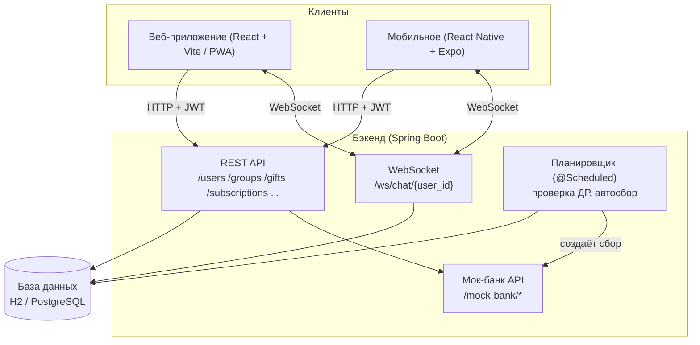
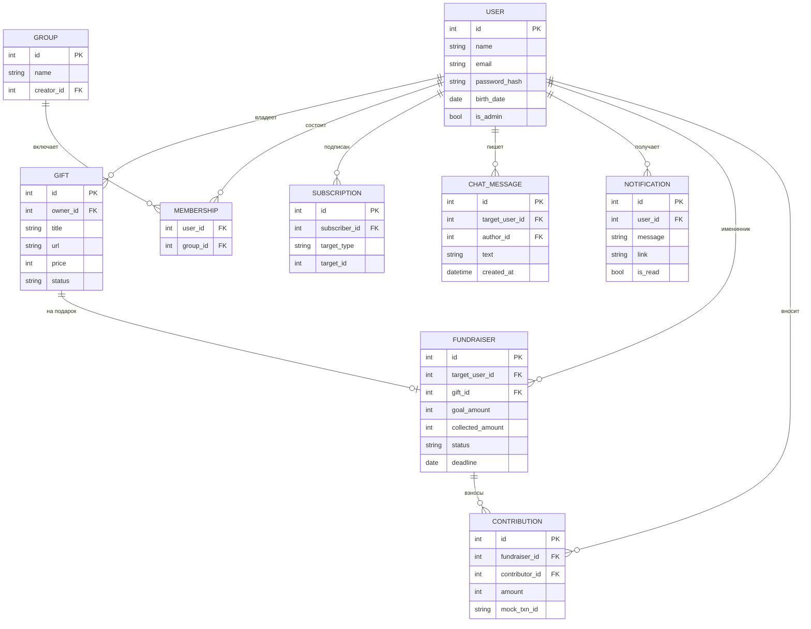

# Стратегия хакатона: система организации дней рождения

**Цель: коэффициент 1,4 (максимум).**
Делаем всё: веб + PWA + мобильное приложение, все 4 усложнения. Срок — 2–3 дня.

---

## 0. TL;DR — как забрать 1,4

Базовый коэффициент **1,2** дают за полностью рабочее ядро (все пользовательские сценарии из ТЗ). Разницу до **1,4** добирают **усложнения** и **две платформы**. Поэтому стратегия простая:

1. **Сначала — железобетонное ядро.** Все 7 сценариев из ТЗ работают end-to-end. Это ваш «пол» в 1,2.
2. **Потом — усложнения по одному**, от самого выигрышного к самому дешёвому: реалтайм-чат → сбор средств → админка → календарь.
3. **Мобильное — двумя шагами:** сначала PWA (почти бесплатно, ваш веб становится «устанавливаемым» на телефон), затем нативное приложение на React Native (переиспользует тот же API).
4. **Полировка под защиту:** авторизация, валидация, авто-документация API (Swagger), тестовые данные (seed), README. Именно это отличает «работает» от «1,4».

**Ключевая мысль:** жюри ставит высокий балл не за количество кода, а за то, что продукт **целостный, рабочий и вы его понимаете**. Половина успеха — уверенная защита. Под это заточен весь план ниже.

---

## 1. Разбор задания: чеклист требований

### Ядро (обязательное — это ваш 1,2)

- [ ] Веб-сервис (бэкенд с API) + пользовательский интерфейс.
- [ ] Хранение сведений о днях рождения пользователей.
- [ ] **Карточка друга** содержит: имя, дату рождения, группы, список желаемых подарков, чат для обсуждения подарка (без самого именинника).
- [ ] Просмотр всех пользователей системы и их дат рождения.
- [ ] Подписка на уведомления: по конкретному другу **или** сразу по группе.
- [ ] Напоминания о приближающихся днях рождения (заранее).
- [ ] Список желаемых подарков: просмотр чужих + публикация своего.
- [ ] Группы: любой пользователь может создать группу; общий список групп доступен всем; можно вступить.
- [ ] Чат обсуждения подарка на странице друга (именинник его не видит).

### Усложнения (это добор до 1,4 — делаем все)

- [ ] **Административный интерфейс:** управление пользователями, группами, списками; импорт данных.
- [ ] **Автосбор средств через «псевдо-банк» с мок-API:** за N дней до ДР система создаёт сбор и рассылает подписчикам ссылку.
- [ ] **Интеграция с календарём** (Google/Яндекс) — минимум через экспорт `.ics` + ссылка-добавление в Google Calendar.
- [ ] **Реалтайм-чат** (WebSocket): сообщения приходят без перезагрузки страницы.

### Платформы (явный бонус в ТЗ — «реализация обоих вариантов даёт доп. баллы»)

- [ ] Веб-приложение.
- [ ] Мобильное: PWA (быстро) и/или нативное React Native (весомее).

---

## 2. Карта баллов: что на 1,2, а что на 1,4

| Что реализовано | Вклад | Комментарий |
|---|---|---|
| Все 7 сценариев ядра работают end-to-end | **1,2 (пол)** | Без этого усложнения не спасут |
| Реалтайм-чат (WebSocket) | +++ | Самое эффектное на демо, «вау» без слов |
| Сбор средств (мок-банк, автосоздание) | +++ | Полноценная бизнес-логика + автоматизация |
| Две платформы (веб + мобильное) | +++ | Прямо прописано в ТЗ как доп. баллы |
| Админка с импортом данных | ++ | Показывает системность |
| Календарь (.ics / Google) | + | Дёшево, добавляем последним |
| Авторизация, валидация, Swagger, seed, README | ++ | «Продуктовость» — жюри это ценит и спрашивает |

Вывод: **ядро + чат + сбор средств + две платформы** уже уверенно тянут на 1,4. Админка и календарь — усиление и подстраховка.

---

## 3. Технологический стек и почему именно он

Стек выбран под вашу команду: бэкенд на **Java**, который вы знаете, а веб и мобильное — на **React** (учится один раз, применяется и в вебе, и в iOS). Синтаксис JS близок к Java, поэтому порог входа на клиенте ниже, чем кажется.

| Слой | Технология | Почему именно так (аргумент для защиты) |
|---|---|---|
| **Бэкенд** | **Java + Spring Boot** | Индустриальный стандарт, всё встроено: Spring Web (REST), Spring WebSocket (чат), Spring Data JPA (БД), `@Scheduled` (напоминания одной аннотацией). Жюри ожидает именно Spring. |
| **ORM / БД** | **Spring Data JPA + H2** | H2 — БД без настройки (in-memory или файл), есть веб-консоль `/h2-console` для демо. На защите: «в проде меняем на PostgreSQL правкой `application.properties`» — это правда. |
| **Веб-фронтенд** | **React + Vite** | Стандарт индустрии, море примеров. Vite — быстрый запуск. Роутинг — React Router, запросы — Axios. |
| **PWA** | **vite-plugin-pwa** | Тот же веб превращается в «устанавливаемое» приложение с иконкой и оффлайн-кэшем. «Мобильная версия» почти бесплатно (но на iOS у PWA урезаны пуши — там надёжнее нативное). |
| **Мобильное (iOS/Android)** | **React Native + Expo** | Один код на iOS и Android, переиспользует React и **тот же API**. На ваших Маках — запуск через iOS-симулятор или Expo Go на айфоне. |
| **Реалтайм** | **Spring WebSocket** | Один эндпоинт `/ws/chat/{userId}`, «комнаты» по имениннику. |
| **Авторизация** | **JWT (jjwt) + BCrypt** | Пароль хэшируется BCrypt, на входе выдаётся JWT-токен. Делаем один понятный JWT-фильтр вместо полной машинерии Spring Security — чтобы легко защищать. |
| **Валидация / доки** | **Bean Validation + springdoc** | `@Valid` / `@NotNull` для проверки данных; Swagger UI автоматически на `/swagger-ui.html` — показываем жюри вживую. |
| **Планировщик** | **`@Scheduled`** | Встроен в Spring, одна аннотация. Раз в сутки проверяет ближайшие ДР → шлёт напоминания и автосоздаёт сборы. |

**Почему это защищаемо:** три «мира» проекта — бэкенд на Java, веб и мобильное на React. Путь запроса линеен и прослеживается пальцем: **клиент → контроллер → сервис → репозиторий (JPA) → БД → ответ**. Единственное место с «магией» Spring — авторизация; её делаем минимальной и комментируем построчно (см. раздел 10).

---

## 4. Архитектура системы



**Как читать:** оба клиента ходят в один и тот же бэкенд. Обычные данные — по REST с JWT-токеном. Чат — по WebSocket. Планировщик работает в фоне: смотрит на приближающиеся ДР, создаёт уведомления и сборы средств. Мок-банк — отдельный набор эндпоинтов, имитирующий сторонний банк.

---

## 5. Модель данных (ER)



### Сущности словами

- **USER** — и аккаунт, и «друг» одновременно. В системе видны все пользователи и их даты рождения. `is_admin` даёт доступ в админку.
- **GROUP** + **MEMBERSHIP** — группы (972501 ТГУ, сборная по волейболу и т.п.), связь многие-ко-многим. Создать группу может любой.
- **GIFT** — элемент вишлиста. `status`: хочу / зарезервирован / куплен.
- **CHAT_MESSAGE** — сообщение в обсуждении подарка. `target_user_id` — чей это «зал обсуждения» (страница именинника), `author_id` — кто написал.
- **SUBSCRIPTION** — подписка на пользователя (`target_type='user'`) или на группу (`target_type='group'`).
- **NOTIFICATION** — сгенерированное напоминание (приближается ДР / создан сбор).
- **FUNDRAISER** + **CONTRIBUTION** — сбор средств и взносы через мок-банк.

### ⚠️ Главное правило приватности (частый вопрос жюри)

**Именинник не должен видеть чат обсуждения своего подарка.** На сервере в эндпоинте чата стоит проверка: если `запрашивающий == target_user_id` → доступ запрещён (403). Это защита на уровне API, а не только «спрятали кнопку в интерфейсе». Обязательно проговорите это на защите — показывает, что вы думаете про безопасность.

---

## 6. API — список эндпоинтов

```
АВТОРИЗАЦИЯ
  POST   /auth/register           регистрация
  POST   /auth/login              логин → JWT-токен
  GET    /auth/me                 текущий пользователь

ПОЛЬЗОВАТЕЛИ / ДРУЗЬЯ
  GET    /users                   все пользователи + даты ДР (сортировка по ближайшему ДР)
  GET    /users/{id}              карточка: имя, ДР, группы, вишлист
  PATCH  /users/{id}              редактировать свой профиль

ГРУППЫ
  GET    /groups                  общий список групп (доступен всем)
  POST   /groups                  создать группу (любой пользователь)
  POST   /groups/{id}/join        вступить в группу
  GET    /groups/{id}/members     участники группы

ПОДАРКИ (ВИШЛИСТ)
  GET    /users/{id}/gifts        вишлист пользователя
  POST   /gifts                   опубликовать свой подарок
  PATCH  /gifts/{id}              изменить статус (зарезервирован/куплен)
  DELETE /gifts/{id}              удалить свой подарок

ПОДПИСКИ И УВЕДОМЛЕНИЯ
  POST   /subscriptions           подписка на друга или группу
  DELETE /subscriptions/{id}      отписаться
  GET    /notifications           мои напоминания
  POST   /notifications/{id}/read отметить прочитанным

ЧАТ (РЕАЛТАЙМ)
  WS     /ws/chat/{user_id}       WebSocket-комната обсуждения подарка
  GET    /users/{id}/chat         история сообщений (кроме самого именинника)

СБОР СРЕДСТВ + МОК-БАНК
  POST   /fundraisers             создать сбор (или создаётся автоматически)
  GET    /fundraisers/{id}        статус сбора: цель / собрано
  POST   /fundraisers/{id}/contribute   внести взнос (через мок-банк)
  POST   /mock-bank/charge        имитация списания, возвращает txn_id

КАЛЕНДАРЬ
  GET    /users/{id}/calendar.ics экспорт ДР в .ics
  GET    /calendar/google-link/{id}  ссылка «добавить в Google Календарь»

АДМИНКА (только is_admin)
  GET    /admin/users             управление пользователями
  POST   /admin/import            импорт пользователей/групп (CSV/JSON)
  DELETE /admin/users/{id}        удалить пользователя
```

Полный список с примерами запросов сгенерируется автоматически на `/swagger-ui.html` (springdoc) — это же ваша шпаргалка на демо.

---

## 7. Ключевые механики (как это работает под капотом)

**Напоминания.** Планировщик (`@Scheduled`) раз в сутки берёт всех, у кого ДР через N дней (например, 7). Для каждого именинника собирает список подписчиков = прямые подписки на него + подписчики групп, в которых он состоит. Каждому создаёт `NOTIFICATION`. Если пользователь онлайн — уведомление прилетает по WebSocket; если нет — увидит при следующем заходе (иконка-колокольчик).

**Приватность чата.** Чат привязан к «залу» именинника (`target_user_id`). При подключении к `/ws/chat/{user_id}` и при запросе истории сервер проверяет: `current_user != user_id`. Именинник физически не может получить эти сообщения.

**Реалтайм-чат.** Один WebSocket-эндпоинт. Сервер держит словарь «комната именинника → список активных подключений». Пришло сообщение → сохраняем в БД → рассылаем всем в комнате, кроме именинника. Обновление страницы не нужно.

**Сбор средств.** За M дней до ДР (например, 3) планировщик автоматически создаёт `FUNDRAISER` на самый желанный подарок и шлёт подписчикам уведомление со ссылкой. Взнос идёт через `/mock-bank/charge` — тот возвращает фейковый `txn_id` и «успех». `collected_amount` растёт, показываем прогресс-бар. Никаких реальных денег — чистая имитация, как и просит ТЗ.

**Календарь.** Эндпоинт отдаёт `.ics`-файл с событием ДР (повтор ежегодно) — открывается в любом календаре (Google, Яндекс, Apple). Плюс «ленивая» ссылка-конструктор для добавления в Google Calendar одним кликом. Это закрывает пункт без сложной OAuth-возни (но если будет время — можно добить полноценным OAuth).

**Подписки.** Одна таблица на оба случая: `target_type` = `user` или `group`. Подписка на группу = подписка на ДР всех её участников.

---

## 8. План на 2–3 дня (roadmap)

### День 0 — подготовка (2–3 часа, вечер до старта)
- Репозиторий, структура папок (`/backend`, `/web`, `/mobile`).
- Сущности JPA + **seed** (`CommandLineRunner`) с тестовыми пользователями, группами, подарками. Тестовые данные критичны: без них демо пустое.
- Скелет Spring Boot (Spring Initializr), эндпоинт `/health`, Swagger `/swagger-ui.html`.

### День 1 — ЯДРО (это ваш 1,2)
- Утро: авторизация (register/login/JWT), `GET /users`, карточка `GET /users/{id}`.
- День: группы (создать/вступить/список), вишлист (CRUD подарков).
- Вечер: подписки + базовые уведомления (без реалтайма — просто список). Веб-фронт: страницы «Люди», «Карточка друга», «Мой вишлист», «Группы».
- **Чекпоинт вечера: все сценарии ядра кликаются в браузере.**

### День 2 — УСЛОЖНЕНИЯ (добор до 1,4)
- Утро: **реалтайм-чат** (WebSocket + UI чата на карточке друга). Самый эффектный пункт — делаем первым.
- День: **сбор средств** (мок-банк, автосоздание, прогресс-бар) + планировщик напоминаний.
- Вечер: **PWA** (manifest + service worker → «устанавливается» на телефон) и **админка** (управление + импорт).
- **Чекпоинт вечера: чат и сбор работают, PWA ставится на телефон.**

### День 3 — МОБИЛЬНОЕ + ПОЛИРОВКА + ЗАЩИТА
- Утро: **нативное приложение (React Native/Expo)** — экраны «Люди», «Карточка», «Уведомления». Переиспользует API. *Стретч-цель: если время поджимает — PWA уже частично закрывает мобильный бонус.*
- День: **календарь** (.ics), финальная полировка UI, обработка ошибок, README.
- Вечер: **репетиция защиты** по разделу 10, прогон демо-сценария (раздел 11), фикс мелочей.

> Приоритет при нехватке времени: **ядро → чат → сбор → PWA → админка → нативное мобильное → календарь.** Режем с конца.

---

## 9. Разделение работы в команде

Роли подстраиваются под размер команды. Ориентир на 3–4 человека:

- **Backend-инженер:** модели, API, WebSocket, планировщик, мок-банк, seed. Сердце проекта.
- **Web-фронтендер:** React-страницы, роутинг, PWA, интеграция с API и WebSocket.
- **Mobile-разработчик:** React Native/Expo, переиспользование API-слоя. Если команда 2–3 человека — эту роль берёт web-фронтендер после PWA.
- **Интеграции / «продуктовость» / защита:** админка, календарь, README, тестовые данные, репетиция защиты, оформление демо.

Совет: договоритесь о **контракте API заранее** (раздел 6) — тогда фронт и бэк пилятся параллельно, не блокируя друг друга. Можно замокать ответы на фронте, пока бэк не готов.

---

## 10. Что спросят на защите по коду (и как отвечать)

Готовьтесь к тому, что жюри ткнёт в конкретную строку. Вероятные вопросы:

1. **«Как хранятся пароли?»** → Не в открытом виде. Хэшируем BCrypt (`BCryptPasswordEncoder`), в БД лежит только хэш. При логине сравниваем хэши.
2. **«Как работает авторизация между запросами?»** → После логина выдаём JWT-токен, клиент шлёт его в заголовке `Authorization: Bearer ...`, сервер проверяет подпись и достаёт пользователя.
3. **«Почему именинник не видит чат про свой подарок?»** → Проверка на сервере: в эндпоинте чата сравниваем `current_user` и `target_user_id`, при совпадении — 403. Защита на уровне API, а не только UI.
4. **«Как устроен реалтайм?»** → WebSocket. Сервер держит комнаты по имениннику, новое сообщение сохраняется в БД и рассылается всем в комнате (кроме именинника). Перезагрузка не нужна.
5. **«Как приходят напоминания?»** → Фоновый планировщик (`@Scheduled`) раз в сутки ищет ДР через N дней и создаёт уведомления для всех подписчиков (по другу и по группам).
6. **«Что такое мок-банк и где реальные деньги?»** → Денег нет, это имитация: эндпоинт возвращает фейковый `txn_id` и «успех», чтобы продемонстрировать сценарий сбора. В проде сюда встаёт реальный платёжный провайдер.
7. **«Почему H2, а не "взрослая" БД?»** → Для демо — ноль настройки, есть веб-консоль. Через JPA переезд на PostgreSQL — это правка `application.properties`, код не меняется.
8. **«Как подписка на группу превращается в уведомления по всем участникам?»** → При рассылке разворачиваем группу в список её участников и уведомляем подписчиков.
9. **«Что если два человека купят один подарок?»** → У подарка есть `status` (зарезервирован/куплен) — резервируется в вишлисте, остальные видят статус.
10. **«Покажите, как запрос доходит от кнопки до базы.»** → Проследите пальцем: клик в React → Axios-запрос → контроллер Spring → сервис → репозиторий JPA → БД → ответ. Отрепетируйте это на одном сценарии (например, «добавить подарок»).

**Совет:** пусть каждый в команде уверенно объясняет «свой» слой и в общих чертах — соседний. Один немой участник на защите роняет балл сильнее, чем недоделанная фича.

---

## 11. Чеклист демо (5 минут для жюри)

Отрепетируйте единый сценарий-историю:

1. Логин под пользователем → экран «Люди», отсортированы по ближайшему ДР.
2. Открываем карточку друга: имя, дата, **группы**, **вишлист**.
3. **Подписываемся** на друга и на группу.
4. Открываем **чат обсуждения подарка** → со второго устройства/вкладки пишем сообщение → оно **появляется мгновенно** (вот он, реалтайм).
5. Показываем **колокольчик уведомлений**: «у Ивана ДР через 3 дня».
6. Открываем **автосозданный сбор** → вносим взнос через мок-банк → прогресс-бар растёт.
7. Заходим под **админом** → импорт пользователей из файла.
8. Показываем то же самое на **телефоне** (PWA установлена / нативное приложение).
9. Финал: `/swagger-ui.html` — «а вот всё наше API документировано автоматически».

Держите **две вкладки/устройства** наготове — реалтайм-чат нужно показывать вживую, это главный «вау».

---

## 12. Риски и как их снять

- **Нативное мобильное съест всё время.** → Делаем последним. PWA уже даёт «мобильность». Нативное — стретч.
- **Пустое демо.** → Seed-скрипт с реалистичными данными готовим в День 0.
- **WebSocket «не завёлся» на демо.** → Заранее протестировать в двух вкладках; иметь запасной «поллинг» (обновление раз в 2 сек) как фолбэк.
- **Никто не может ответить по коду.** → Раздел 10, репетиция обязательна.
- **Слияние фронта и бэка в последний момент.** → Фиксируем контракт API (раздел 6) в самом начале.

---

## 13. Следующие шаги (что я готов сгенерировать дальше)

1. **Полный скелет бэкенда** (Spring Boot: сущности, контроллеры, WebSocket, `@Scheduled`, мок-банк, seed-данные) — рабочий с первого запуска.
2. **Веб-фронтенд** (React + Vite + PWA) со всеми экранами.
3. **Мобильное** (React Native / Expo).
4. **Подробный обучающий гайд по коду** — построчный разбор ключевых файлов простым языком, чтобы каждый в команде понимал и мог защитить. (Это тот самый «гайд для обучения», о котором вы просили.)

Скажите, с чего начинаем — я рекомендую **бэкенд + seed-данные**, потому что от него зависят и веб, и мобильное, и все усложнения.
